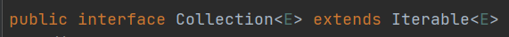
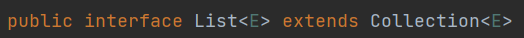

### 集合框架

为什么要使用集合框架？

1、数组的长度是固定

2、数组无法同时存储多个不同的数据类型

集合简单理解就是一个长度可以改变，可以保存任意数据类型的动态数组。

集合本身是数据结果的基本概念之一，我们这里说的集合是 Java 语言对这种数据结果的具体实现。

Java 中的集合不是由一个类来完成的，而是由一组接口和类构成了一个框架体系。大致可分为 3 层，最上层是一组接口，继而是接口的实现类。

### 接口

Collection：集合框架最基础的接口，最顶层的接口(三个子接口：List(列表)、Set(集合)、Queue(队列))。

List：Collection 的子接口，存储有序、不唯一（元素可重复）的对象，最常用的接口。

Set：Collection 的子接口，存储无序、唯一（元素不可重复）的对象。

Queue：Collection 的子接口，队列接口。

Map：独立于 Collection 的另外一个接口，最顶层的接口，存储一组键值对象，提供键到值的映射。

Iterator：输出集合元素的接口，一般适用于无序集合，从前往后输出。

ListIterator：Iterator 子接口，可以双向输出集合中的元素。

Enumeration：传统的输出接口，已经被 Iterator 取代。

SortedSet：Set 的子接口，可以对集合中的元素进行排序。

SortedMap：Map 的子接口，可以对集合中的元素进行排序。

Map.Entry：Map 的内部接口，描述 Map 中存储的一组键值对元素。

### Collection 接口

Collection 是集合框架中最基础的父接口，可以存储一组无序，不唯一的对象。



Collection 接口可以存储一组无序，不唯一（可重复）的对象，一般不直接使用该接口，也不能被实例化，只是用来提供规范。

Collection 是 Iterable 接口的子接口。

int size()																						获取集合长度

boolean isEmpty()																	  判断集合是否为空

boolean contains(Object o)														判断集合中是否存在某个对象

Iterator<> iterator()																	实例化 Iterator 接口，遍历集合

Object[] toArray()																			将集合转换为一个 Object 数组

T[] toArray(T[] a)																			将集合转换为一个指定数据类型的数组

boolean add(E e)																			向集合中添加元素

boolean remove(Object o)															从集合中删除元素

boolean containsAll(Collection c)										      	判断集合中是否存在另一个集合的所有元素

boolean addAll(Collection c)														 向集合中添加某个集合的所有元素

boolean removeAll(Collection c)													从集合中删除某个集合的所有元素

void clear()																						清除集合中的所有元素

boolean equals(Collection c)														判断两个集合是否相等

int hashCode()																				返回集合的哈希值

### Collection 子接口

- List：存放有序、不唯一的元素
- Set：存放无序、唯一的元素
- Queue：队列接口

### List 接口



List 常用的扩展方法

T get(int index)														   通过下标返回集合中对应位置的元素

T set(int index,T element)										 在集合中的指定位置存入对象

int indexOf(Object o)												 从前向后查找某个对象在集合中的位置

int lastIndexOf(Object o)											从后向前查找某个对象在集合中的位置

ListIterator<> listIterator()										实例化 ListIterator 接口，用来遍历 List 集合

List<> subList(int fromIndex,int toIndex)				通过下标截取 List 集合

### List 接口的实现类

ArrayList 是开发中使用频率最高的 List 实现类，实现了长度可变的数组，在内存中分配连续空间，所以读取快，增删满。

```java
public class Test {
    public static void main(String[] args) { // add 增加(可以指定位置) set 修改  remove 删除  get 查询
        ArrayList list = new ArrayList();
        list.add("Hello");
        list.add("World");
        list.add("JavaSE");
        list.add("JavaME");
        list.add("JavaEE");
        System.out.println("list:"+list);
        System.out.println("list长度:"+list.size());
        System.out.println("list是否包含Java:"+list.contains("Java"));
        for (int i = 0; i < list.size(); i++) {
            System.out.println(list.get(i));
        }
        Iterator iterator = list.iterator();
        while(iterator.hasNext()){
            System.out.println(iterator.next());
        }
        list.remove("Hello");
        list.remove(0);
        System.out.println("******************");
        System.out.println(list);
        list.add(1,"Spring");
        System.out.println(list);
        list.add(1,"Spring Boot");
        System.out.println(list);
        list.set(1,"Spring Cloud");
        System.out.println(list);
        System.out.println("*************");
        System.out.println(list.indexOf("Spring"));
        System.out.println(list.subList(1,3));
    }
}
```


### List 接口的实现类（ArrayList、LinkedList、Vector）

ArrayList：基于数组的实现，非线程安全，效率高，所有的方法都没有 synchronized 修饰。

Vector：线程安全，效率低，实现线程安全直接通过 synchronized 修饰方法来完成。

Stack：Vector 的子类，实现了栈的数据结构，（后进先出）

- push：入栈方法
- peek：取出栈顶元素，将栈顶复制一份取出，取完之后栈内的数据不变。
- pop：取出栈顶元素，直接取出栈顶元素，取完之后栈内的数据减一。

LinkedList：实现了先进先出的队列，采用链表的形式存储。

ArrayList 和 LinkedList的区别：内存中存储的形式不同，ArrayList 采用的数组的方式，LinkedList采用的是链表的形式。

数组在内存中存储空间是连续的，读取快，增删慢。

因为数组在内存中是连续的，所以取数据可以通过寻址公式很快求出目标元素的内存地址，因为内存是连续的，所以新增或者删除元素，必然需要移动数据，而且数组长度越长，需要移动的元素越多，操作就越慢。

链表在内存中存储空间是不连续的，读取慢，增删快。链表在内存中是不连续的，没有固定的公式可以使用，要读取只能从第一位开始一直遍历到目标元素，数据规模越大，操作越慢。

增删快，因为只需要重新设置目标元素前后两个节点的后置指针即可，与数据规模无关。


LinkedList 和 Stack 都有 pop 方法，有什么区别和相同点？

pop 方法都是取出集合中的第一个元素，但是两者的顺序是相反的，Stack 是“后进先出”，所以 pop 取出的是最后一个元素，LinkedList 是“先进先出”，所以 pop 取出的是第一个元素。

LinkedList (即实现List、Queue两个大接口)实现了 Deque 接口，而 Deque 接口是 Queue 的子接口，Queue 就是队列，底层实现了队列的数据结构。

实际开发中，不能直接实例化 Queue 对象。

Queue 的实现类是 AbstractQueue，它是一个抽象类，不能直接实例化，开发中需要实现它的子类 PriorityQueue。

```java
public class Test {
    public static void main(String[] args) {
        LinkedList linkedList = new LinkedList();
        linkedList.add(1); // 当作队列使用 
        linkedList.add(2); // 此时是 [1,2]
        linkedList.pop(); // pop总是pop出第一个元素
        linkedList.pop();
        linkedList.push(1); // 当作栈使用 
        linkedList.push(2); //此时是 [2,1]
        linkedList.pop();
        linkedList.pop();
    }
}
```


### Set

跟 List 一样，Set 是 Collection 的子接口，Set 集合是以散列的形式存储数据，所以元素是没有顺序的，可以存储一组无序且唯一的数据。

Set 常用实现类：

- HashSet
- LinkedHashSet
- TreeSet

HashSet 是开发中经常使用的一个实现类，存储一组无序且唯一的对象。

无序：元素的存储顺序和遍历顺序不一致。

```java
public class Test {
    public static void main(String[] args) {
        HashSet set = new HashSet();
        set.add("Hello");
        set.add("World");
        set.add("Java");
        set.add("Hello");
        Iterator iterator = set.iterator();
        while(iterator.hasNext()){
            System.out.println(iterator.next());
        }
        set.remove("World");
        System.out.println("****************");
        iterator = set.iterator();
        while(iterator.hasNext()){
            System.out.println(iterator.next());
        }
    }
}
```

LinkedHasSet 是 Set 的另外一个实现类，可以存储一组有序且唯一的元素.

有序：元素的存储顺序和遍历顺序一致。

```java
public class Test {
    public static void main(String[] args) {
        LinkedHashSet linkedHashSet = new LinkedHashSet();
        linkedHashSet.add("Hello");
        linkedHashSet.add("World");
        linkedHashSet.add("Java");
        linkedHashSet.add("Hello");
        System.out.println("LinkedHashSet的长度是"+linkedHashSet.size());
        System.out.println("遍历LinkedHashSet");
        Iterator iterator = linkedHashSet.iterator();
        while(iterator.hasNext()){
            System.out.println(iterator.next());
        }
        linkedHashSet.remove("Java");
        System.out.println(linkedHashSet.contains("Java"));
    }
}
```

equals 和 == 的区别？

所有类中的 equals 都是继承自 Object 类，Object 类中原生的 eqauls 方法就是在通过 == 进行判断

但是每个类都可以对 equals 方法进行重写，覆盖掉之前使用 == 进行判断的逻辑，改用新的逻辑进行判断是否相等。

LinkedHashSet 如何判断两个对象是否相等？

首先会判断两个对象的 hashCode 是否相等

什么是 hashCode？

将对象的内部信息（内存地址、属性值等），通过某种特定规则转换成一个散列值，就是该对象的 hashCode。

- 两个不同对象的 hashCode 值可能相等。
- hashCode 不相等的两个对象一定不是同一个对象。

集合在判断两个对象是否相等的时候，会先比较他们的 hashCode，如果 hashCode 不相等，则认为不是同一个对象，可以添加。

如果 hashCode 值相等，还不能认为两个对象是相等的，需要通过 equals 进行进一步的判断，equals 相等，则两个对象相等，否则两个对象不相等。

```java
public class Test {
    public static void main(String[] args) {

        LinkedHashSet set = new LinkedHashSet(); // 它的构造方法是 super(16, .75f, true) ，也即调用的是是父类HashSet的构造方法
        // 构造方法里面将自己的成员 map = new LinkedHashMap<>(initialCapacity, loadFactor)  注意这里的map成员变量是HashMap(多态)
        Data data1 = new Data(1);
        set.add(data1);
        Data data2 = new Data(1);
        set.add(data2); // 这里也调用了一次equals LinkedHashSet继承了HashSet，调用的add方法是HashSet的add方法,add方法调用的是
        //HashMap的 map.put(e, PRESENT) PRESENT就是new Object()，，即只用了HashMap的key的唯一性

        System.out.println(data1.equals(data2)); // true

        System.out.println(set); // 只有一个数据

    }
}

class Data{
    private int num;

    public Data(int num) {
        this.num = num;
    }

    @Override
    public String toString() {
        return "Data{" +
                "num=" + num +
                '}';
    }

    //hashcode
    @Override
    public boolean equals(Object obj) {
        if (this == obj) { // 两个地址不一样 不走
            return true;
        }
        //instanceof 判断对象是否属于某个类
        if(obj instanceof Data){ // 是不是Data类型 是的
            Data data = (Data) obj; // obj和data是同一个对象(地址相同)  向下转型 不然取不到num属性
            if(this.num == data.num){
                return true;
            }
        }
        return false;
    }

    @Override
    public int hashCode() {
        return 1;
    }
}
```

==：判断的是栈内存中的值。

引用类型的数据，栈内存中存储的是地址，所以此时 == 判断的是引用地址。

基本数据类型，栈内存中存储的是具体的数值。

栈中存储的是变量

Data data;

int num;

引用类型具体的对象（属性）存储在堆中的，再将堆中对象的内存地址赋值给栈中的变量 data，data 中存储的就是地址。

基本数据类型不需要用到堆内存，变量在栈中，变量的值直接存储在变量中。


### TreeSet

LinkedHashSet 和 TreeSet 都是存储一组有序且唯一的数据，但是这里的两个有序是有区别的。

LinkedHashSet 的有序是指元素的存储顺序和遍历顺序是一致的。

TreeSet 的有序是指集合内部会自动对所有的元素按照升序进行排列，无论存入的顺序是什么，遍历的时候一定按照生序输出。
