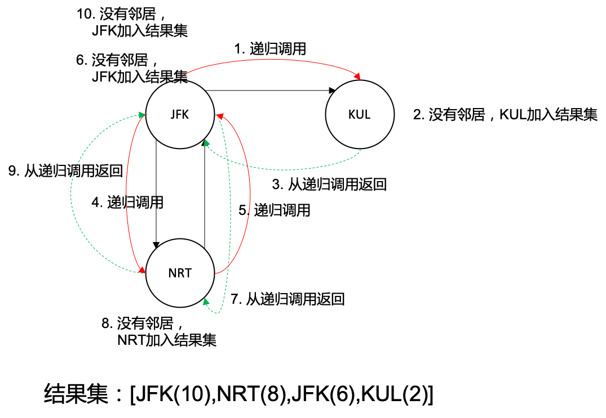

#### 双指针

##### 删除有序数组中的重复项(26)

```java
    public int removeDuplicates(int[] nums) {
        int i = 0, j = 0;
        while (j < nums.length) {
            // 两个元素不相等
            if (nums[i] != nums[j]) {
                // 两个指针都往后移动一位，但是前指针的后一个元素的值是后指针的元素的值
                nums[++i] = nums[j++];
            } else {
                // 两个元素相等，后指针移动
                j++;
            }
        }
        return i+1;
    }
```

##### 反转字符串(344)

```java
    public void reverseString(char[] s) {
        int i = 0, j = s.length - 1;
        while (i < j) {
            // 双指针，前后交换
            char temp = s[i];
            s[i] = s[j];
            s[j] = temp;
            i++;
            j--;
        }
    }
```

#### 反转链表

##### 迭代(考虑当前节点的任务：将next指针指向前节点，**但是同时不能失去后节点的联系**)

```java
    public ListNode reverseList(ListNode head) {
        // 定义前指针
        ListNode pre = null;
        // 定义后指针
        ListNode next = null;
        // 当前节点不是空的时候
        while(head != null) {
            // 将当前节点的后一个节点给next指针
            next = head.next;
            // 当前节点的next指向前一个节点
            head.next = pre;
            // 移动前节点到当前节点
            pre = head;
            // 移动当前节点到下一个节点
            head = next;
        }
        // 循环结束了 head就是null了，应该返回pre指针
        return pre;
    }
```

##### 递归(隐式调用栈，递归到**最后一个节点**时，递归返回，主要在递归返回的时候对链表进行操作)

```java
    public ListNode reverseList(ListNode head) {
        // 如果本身就是空返回空
        if (head == null) 
            return null;
        // 当前节点的next节点是空的话，返回当前节点
        if (head.next == null )
            return head;
        // 递归调用下一节点，返回的是最后一个节点，但是当前的head指向的是倒数第二个节点
        ListNode node = reverseList(head.next);
        // 将最后一个节点的next指针指向前一个(即当前节点)
        head.next.next = head;
        // 当前节点的next指针指向null
        head.next = null;
        // 返回最后一个节点
        return node; 
    }
```

##### 自定义栈实现

```java
    public ListNode reverseList(ListNode head) {
        // 定义一个栈
        LinkedList<ListNode> stack = new LinkedList<>();
        ListNode node = null;
        // 当节点不为空时将节点push到栈中
        while (head != null) {
            stack.push(head);
            head = head.next;
        }
        // 将最后一个元素pop出来
        if (!stack.isEmpty()) {
            head = stack.pop();
        }
        // node赋值为头节点
        node = head;
        // 循环栈
        while (!stack.isEmpty()) {
            // 将元素pop出来
            ListNode pop = stack.pop();
            // pop出来的元素的next指针为null
            pop.next = null;
            // node的next指针是pop出来的元素
            node.next = pop;
            // 将node的指针往下移动一位
            node = pop;
        }
        return head;
    }
```

#### 树的前中后序遍历

##### 前序遍历

```java
    private static void pre(TreeNode node) {
        // 定义Stack
        LinkedList<TreeNode> stack = new LinkedList<>();
        // 将根节点加入栈中
        stack.push(node);
        // 只要栈不是空的就一直循环下去
        while (!stack.isEmpty()) {
            // 将栈中的节点弹出来
            TreeNode pop = stack.pop();
            // 对其进行操作
            System.out.println(pop.val);
            // 如果不空 加入右边的节点 -> 3 2 下次先弹出2
            if (pop.right != null) {
                stack.push(pop.right);
            }
            // 如果不空 加入左边的节点
            if (pop.left != null) {
                stack.push(pop.left);
            }
        }
    }
```

#### 回溯

##### 全排列(46)

```java
    List<List<Integer>> list = new ArrayList<>();

    /**
     * @param p     数组 {1, 2, 3}
     * @param pb    遍历状态 {false, false, false}
     * @param level 级别 0
     * @param res   结果集
     */
    void dfs(int[] p, boolean[] pb, int level, List<Integer> res) {
        // 等级达到数组长度
        if (level == p.length) {
            // 增加到结果集，并且返回
            List<Integer> re = new ArrayList<>(res);
            list.add(re);
            return;
        }
        // 遍历所有值
        for (int i = 0; i < p.length; i++) {
            // 取出当前值
            int c = p[i];
            // 判断是否遍历过,遍历过直接跳过
            if (!pb[i]) {
                // 加入到结果集
                res.add(c);
                // 状态变为true
                pb[i] = true;
                // 等级+1
                dfs(p, pb, level + 1, res);
                // 从结果集中移除
                res.remove(res.size() - 1);
                // 状态别为false
                pb[i] = false;
            }
        }
    }
```

```java
    List<List<Integer>> res = new ArrayList<>();

    public List<List<Integer>> permute(int[] nums) {
        backtrack(nums, new ArrayList<>());
        return res;
    }

    void backtrack(int[] nums, ArrayList<Integer> track) {
        // 列表长度等于数组长度时，添加结果集
        if (track.size() == nums.length) {
            res.add(new ArrayList<>(track));
            return;
        }
        // 遍历数组
        for (int i = 0; i < nums.length; i++) {
            // 如果结果集里面有当前元素，跳过
            if (track.contains(nums[i])) {
                continue;
            }
            // 结果集加入当前元素
            track.add(nums[i]);
            backtrack(nums, track);
            // 结果集移除当前元素
            track.remove(track.size() - 1);
        }
    }
```

##### N皇后(51)

```java
    List<List<String>> res = new ArrayList<>();

    public List<List<String>> solveNQueens(int n) {
        // 定义n * n 的数组
        String[][] board = new String[n][n];
        // 将数组全部赋值 . 
        for (int i = 0; i < n; i++) {
            for (int j = 0; j < n; j++) {
                board[i][j] = ".";
            }
        }
        // 进行回溯
        backtrack(board, 0);
        return res;
    }

    void backtrack(String[][] board, int row) {
        // 当行到达尾部的时候 记录数据并且返回
        if (row == board[0].length) {
            List<String> list = new ArrayList<>();
            // 对二维数组进行遍历
            for (String[] board1 : board) {
                // 每一行拼接成一个String
                StringBuilder sb = new StringBuilder();
                for (String s : board1) {
                    sb.append(s);
                }
                // 加入到list里面
                list.add(sb.toString());
            }
            // 整个二维数组遍历完成之后将结果集加入到res中
            res.add(list);
            return;
        }
        // 对列进行遍历
        for (int col = 0; col < board[0].length; col++) {
            // 如果不是合法的 跳过继续循环
            if (!isValid(board, row, col)) {
                continue;
            }
            // 将当前变为Q
            board[row][col] = "Q";
            // 进行回溯
            backtrack(board, row + 1);
            // 回归当前状态
            board[row][col] = ".";
        }
    }

    boolean isValid(String[][] board, int row, int col) {
        int n = board.length;
        // 固定列不变，上下滑动，如果是Q，返回false
        for (int i = 0; i < n; i++) {
            if (board[i][col].equals("Q")) {
                return false;
            }
        }
        // 右上角
        for (int i = row - 1, j = col + 1; i >= 0 && j < n; i--, j++) {
            if (board[i][j].equals("Q")) {
                return false;
            }
        }
        // 左上角
        for (int i = row - 1, j = col - 1; i >= 0 && j >= 0; i--, j--) {
            if (board[i][j].equals("Q")) {
                return false;
            }
        }
        return true;
    }
```

##### 路径总和(113)

```java
    List<List<Integer>> res = new ArrayList<>();
    List<Integer> list = new ArrayList<>();
    int sum = 0;
    public List<List<Integer>> pathSum(TreeNode root, int targetSum) {
        if (root == null) {
            return new ArrayList<>();
        }
        return pathSum2(root, targetSum);
    }

    List<List<Integer>> pathSum2(TreeNode root, int targetSum) {
        if (root == null) {
            return null;
        }
        // 前置操作
        // 错误1：将下面两行写道了下面，不对要先加入结果集然后再进行判断
        list.add(root.val);
        sum += root.val;
        if (root.left == null && root.right == null) {
            if (sum == targetSum) {
                // 错误2：没有用new ArrayList，很重要、
                // 错误3：在这里return null了是不对的，在这里return会导致后置操作走不到(直接返回叶子节点的上一节点)
                res.add(new ArrayList<>(list));
            }
        }

        pathSum(root.left, targetSum);
        pathSum(root.right, targetSum);
        // 后置操作，回溯的后将结果集恢复
        sum -= root.val;
        list.remove(list.size() -1);
        return res;
    }
```

##### 子集(78)

```java
    List<List<Integer>> res = new ArrayList<>();
    List<Integer> list = new ArrayList<>();
    public List<List<Integer>> subsets(int[] nums) {
        backtrack(nums, list, 0);
        return res;
    }

    void backtrack(int[] nums, List<Integer> list,int start) {
        res.add(new ArrayList<>(list));
        for (int i = start; i < nums.length; i++) {
            list.add(nums[i]);
            backtrack(nums, list, i + 1);
            list.remove(list.size() - 1);
        }
    }
```

##### 组合(77)

```java
    List<List<Integer>> res = new ArrayList<>();
    List<Integer> list = new ArrayList<>();
    public List<List<Integer>> combine(int n, int k) {
        backtrack(n, k, list ,1);
        return res;
    }

    void backtrack(int n, int k, List<Integer> list, int level) {
        if (list.size() == k) {
          res.add(new ArrayList<>(list));
        } 
        for (int i = level; i <= n; i++) {
            list.add(i);
            backtrack(n, k, list, i + 1);
            list.remove(list.size() - 1);
        }
    }
```


#### BFS

##### 二叉树的层序遍历(102)

```java
    List<List<Integer>> res = new ArrayList<>();
    
    List<List<Integer>> levelOrder(TreeNode root) {
        if (root == null) {
            return new ArrayList<>();
        }
        // 定义队列
        LinkedList<TreeNode> queue = new LinkedList<>();
        // 将头节点加入到队列中
        queue.offer(root);
        bfs(root, queue);
        return res;
    }

    /**
     * 进行BFS
     * @param root
     * @param queue
     */
    void bfs(TreeNode root,LinkedList<TreeNode> queue) {
        // 当队列不为空
        while (!queue.isEmpty()) {
            // 队列长度为size
            int size = queue.size();
            // 定义结果集
            List<Integer> result = new ArrayList<>();
            // 遍历队列
            for (int i = 0;i < size; i++) {
                // 将队列里面元素poll出来
                TreeNode node = queue.poll();
                // 添加到结果集
                result.add(node.val);
                // 顺便将当前的node的左孩子和右孩子加入到队列当中
                if (node.left != null) {
                    queue.offer(node.left);
                }
                if (node.right != null) {
                    queue.offer(node.right);
                }
            }
            // 加入到总的结果集中
            res.add(result);
        }
    }
```

##### 二叉树的右视图(199)

```java
    List<Integer> rightSideView(TreeNode root) {
        List<Integer> res = new ArrayList<>();
        if (root == null ) {
            return res;
        }
        bfs(root,res);
        return res;
    }

    void bfs(TreeNode root,List<Integer> res) {
        LinkedList<TreeNode> queue = new LinkedList<>();
        queue.offer(root);
        while (!queue.isEmpty()) {
            // 将当前队列的首元素(即每一层的最右节点)加入到结果集中
            res.add(queue.peek().val);
            int size = queue.size();
            for (int i = 0; i < size; i++) {
                TreeNode node = queue.poll();
                // 每次都先加入右孩子，再加入左孩子
                if (node.right != null) {
                    queue.offer(node.right);
                }
                if (node.left != null) {
                    queue.offer(node.left);
                }
            }
        }
    }
```

##### 地图分析(1162)

```java
    public int maxDistance(int[][] grid) {
        // 拿到数组行的长度
        int len = grid.length;
        // 定义队列
        LinkedList<int[]> queue = new LinkedList<>();
        // 遍历二维数组，如果值为1，将其的坐标加入到队列当中
        for (int i = 0; i < len; i++) {
            for (int j = 0; j < len; j++) {
                if (grid[i][j] == 1) {
                    queue.add(new int[]{i,j});
                }
            }
        }
        // 如果队列长度是空或者len * len 直接返回 -1
        if (queue.size() == len * len || queue.isEmpty()) {
            return -1;
        }
        // 4 * 2 的二维数组，代表上下左右
        int[][] steps = {
                {1,0},{-1,0},{0,1},{0,-1}
        };
        // 初始化times -1
        int times = -1;
        // 当队列不为空
        while (!queue.isEmpty()) {
            // 次数+1
            times++;
            // 队列长度
            int size = queue.size();
            // 遍历当前队列的每一个int[]对象
            for (int i = 0;i < size;i++) {
                // 取出队列元素
                int[] temp = queue.pop();
                // 取出行
                int r = temp[0];
                // 取出列
                int c = temp[1];
                // 对上下左右这个二维数组进行遍历
                for (int[] step:steps) {
                    // 新r1
                    int r1 = r + step[0];
                    // 新c1
                    int c1 = c + step[1];
                    // 如果在区域内并且值是0的话，将其加入到队列，并且标记2说明已经访问过了
                    if (inArea(grid,r1,c1) && grid[r1][c1] == 0) {
                        // 不标记的话，下次还会将其加入，不对
                        grid[r1][c1] = 2;
                        queue.add(new int[]{r1,c1});
                    }
                }
            }
        }
        return times;
    }

    boolean inArea(int[][] grid,int r,int c) {
        int n = grid.length;
        return r >= 0 && r < n && c >=0 && c < n;
    }
```


##### 单词接龙(127)

```java
    public int ladderLength(String startWord, String endWord, List<String> list) {
        // 如果列表里面没有结束单词就返回0
        if (!list.contains(endWord)) {
            return 0;
        }
        // 如果列表里面没有开始单词就将其加入到列表
        if (!list.contains(startWord)) {
            list.add(startWord);
        }
		// 构建图
        Map<String, List<String>> graph = graph(list);
        // 定义步数1
        int step = 1;
        // 定义访问的set集合
        Set<String> visited = new HashSet<>();
        // 定义队列
        LinkedList<String> queue = new LinkedList<>();
        // 将开始单词加入到访问集合中
        visited.add(startWord);
        // 将开始单词加入到队列当中
        queue.add(startWord);
        // 当队列不为空
        while (!queue.isEmpty()) {
            // 拿到队列的长度
            int size = queue.size();
            // 遍历队列
            for (int i = 0;i < size;i++) {
                // 将队列当中的元素拿出来
                String cur = queue.pop();
                // 如果说当前的元素就是结束的单词，直接返回步数
                if (cur.equals(endWord)) {
                    return step;
                }
                // 将该单词有相连边的列表取出来，如果没有相连边就new一个防止空指针
                List<String> lists = graph.getOrDefault(cur,new ArrayList<>());
                // 遍历所有的边
                for (String s : lists) {
                    // 如果没有访问过
                    if (!visited.contains(s)) {
                        // 将其变为访问过
                        visited.add(s);
                        // 队列中加入该单词
                        queue.add(s);
                    }
                }
            }
            // 步数+1
            step ++;
        }

        return 0;
    }

    private Map<String,List<String>> graph(List<String> list) {
        // 拿到列表的长度
        int size = list.size();
        // 定义图
        Map<String,List<String>> map = new HashMap<>();
        // 两个单词之间的关系进行遍历
        for (int i = 0; i < size; i++) {
            for (int j = i + 1; j < size; j++) {
                // 拿到单词1
                String s1 = list.get(i);
                // 拿到单词2
                String s2 = list.get(j);
                // 如果两个单词之间只有一个不同
                if (oneChange(s1,s2)) {
                    // 以s1作为key，list作为列表，将s2加入到列表中
                    map.computeIfAbsent(s1,k -> new ArrayList<>()).add(s2);
                    // 以s2作为key，list作为列表，将s1加入到列表中
                    map.computeIfAbsent(s2,k -> new ArrayList<>()).add(s1);
                }
            }
        }
        return map;
    }

    private boolean oneChange(String s1, String s2) {
        int diff = 0;
        for (int i = 0; i< s1.length(); i++) {
            char c1 = s1.charAt(i);
            char c2 = s2.charAt(i);
            if (c1 != c2) {
                diff ++;
            }
        }
        return diff == 1;
    }
```

```java
    public int ladderLength(String startWord, String endWord, List<String> list) {
        if (!list.contains(endWord)) {
            return 0;
        }
        if (!list.contains(startWord)) {
            list.add(startWord);
        }

        Map<String, List<String>> graph = graph(list);
        int step = 1;
        Set<String> visited = new HashSet<>();
        LinkedList<String> queue = new LinkedList<>();
        visited.add(startWord);
        queue.add(startWord);
        while (!queue.isEmpty()) {
            int size = queue.size();
            for (int i = 0;i < size;i++) {
                String cur = queue.pop();
                if (cur.equals(endWord)) {
                    return step;
                }
                // List<String> lists = graph.getOrDefault(cur,new ArrayList<>());
                // 将上面这个语句转换一下
                List<String> lists = graph.get(cur);
                if (lists == null) {
                    lists = new ArrayList<>();
                }
                for (String s : lists) {
                    if (!visited.contains(s)) {
                        visited.add(s);
                        queue.add(s);
                    }
                }
            }
            step ++;
        }

        return 0;
    }

    private Map<String,List<String>> graph(List<String> list) {
        int size = list.size();
        Map<String,List<String>> map = new HashMap<>();
        for (int i = 0; i < size; i++) {
            for (int j = i + 1; j < size; j++) {
                String s1 = list.get(i);
                String s2 = list.get(j);
                if (oneChange(s1,s2)) {
                    // map.computeIfAbsent(s1,k -> new ArrayList<>()).add(s2);
                    // map.computeIfAbsent(s2,k -> new ArrayList<>()).add(s1);
                    // 将上面这两个语句转换一下
                    // computeIfAbsent两个参数，第一个Key，第二个value
                    // 如果key取出来是null，将key和value加入
                    // 如果key取出来的不是null，返回的就是之前的value
                    List<String> list1 = map.get(s1);
                    List<String> list2 = map.get(s2);
                    if (list1 == null) {
                        List<String> list11 = new ArrayList<>();
                        list11.add(s2);
                        map.put(s1, list11);
                    } else {
                        list1.add(s2);
                        map.put(s1, list1);
                    }
                    if (list2 == null) {
                        List<String> list22 = new ArrayList<>();
                        list22.add(s1);
                        map.put(s2, list22);
                    } else {
                        list2.add(s1);
                        map.put(s2, list2);
                    }
                }
            }
        }
        return map;
    }

    private boolean oneChange(String s1, String s2) {
        int diff = 0;
        for (int i = 0; i< s1.length(); i++) {
            char c1 = s1.charAt(i);
            char c2 = s2.charAt(i);
            if (c1 != c2) {
                diff ++;
            }
        }
        return diff == 1;
    }
```

##### 矩阵(542)

```java
    public int[][] updateMatrix(int[][] grid) {
        // 拿到数组行的长度
        int len = grid.length;
        // 拿到数组列的长度
        int len1 = grid[0].length;
        // 定义结果集
        int[][] res = new int[len][len1];
        // 定义访问集
        boolean[][] visited = new boolean[len][len1];
        // 定义队列
        LinkedList<int[]> queue = new LinkedList<>();
        // 遍历二维数组，如果值为0，将其的坐标加入到队列当中，并且将其标记为已访问
        for (int i = 0; i < len; i++) {
            for (int j = 0; j < len1; j++) {
                if (grid[i][j] == 0) {
                    queue.add(new int[]{i, j});
                    visited[i][j] = true;
                }
            }
        }
        // 4 * 2 的二维数组，代表上下左右
        int[][] steps = {
                {1, 0}, {-1, 0}, {0, 1}, {0, -1}
        };
        // 初始化times -1
        int times = -1;
        // 当队列不为空
        while (!queue.isEmpty()) {
            // 次数+1
            times++;
            // 队列长度
            int size = queue.size();
            // 遍历当前队列的每一个int[]对象
            for (int i = 0; i < size; i++) {
                // 取出队列元素
                int[] temp = queue.pop();
                // 取出行
                int r = temp[0];
                // 取出列
                int c = temp[1];
                // 如果当前的值是1的话，将结果集更新
                if (grid[r][c] == 1) {
                    res[r][c] = times;
                }
                // 对上下左右这个二维数组进行遍历
                for (int[] step : steps) {
                    // 新r1
                    int r1 = r + step[0];
                    // 新c1
                    int c1 = c + step[1];
                    // 如果在区域内并且没有访问过的话，将其加入到队列，并且标记其已经访问过了
                    if (inArea(grid, r1, c1) && !visited[r1][c1]) {
                        // 不标记的话，下次还会将其加入，不对
                        visited[r1][c1] = true;
                        queue.add(new int[]{r1, c1});
                    }
                }
            }
        }
        return res;
    }

    boolean inArea(int[][] grid,int r,int c) {
        int n = grid.length;
        int n1 = grid[0].length;
        return r >= 0 && r < n && c >=0 && c < n1;
    }
```

#### DFS

##### 二叉树的最大深度(104)

```java
    public int maxDepth(TreeNode root) {
        // 如果是根节点的话返回0
        if (root == null) {
            return 0;
        }
        // len1代表当前节点的左边的孩子的值
        int len1 = maxDepth(root.left);
        // len2代表当前节点的右边的孩子的值
        int len2 = maxDepth(root.right);
        // 返回的当前节点的值，即左孩子和右孩子的最大值+1
        return Math.max(len1, len2) + 1;
    }
```


##### 二叉树中的最大路径和(124)

```java
    
	// 定义最大值是Integer的最小值
	int max = Integer.MIN_VALUE;

    public int maxPathSum(TreeNode root) {
        function(root);
        return max;
    }

    int function(TreeNode root) {
        // 如果是根节点，返回0
        if (root == null) {
            return 0;
        }
        // i代表左孩子的值
        int i = function(root.left);
        // j代表右孩子的值
        int j = function(root.right);
        // ii代表如果左孩子的值小于0，干脆取0
        int ii = Math.max(i, 0);
        // jj代表如果右孩子的值小于0，干脆取0
        int jj = Math.max(j, 0);
        // 定义当前结果集为当前的值加上左右
        int sum = root.val + ii + jj;
        // 更新max
        max = Math.max(sum, max);
        // 返回当前的值+左孩子或者右孩子
        return root.val + Math.max(ii, jj);
    }
```

##### 求根节点到叶节点数字之和(129)

```java
    // 定义结果集res为0
	int res = 0;
    public int sumNumbers(TreeNode root) {
        // 重新定义一个dfs返回值是void，
        dfs(root,0);
        // 返回结果集
        return res ;
    }

    void dfs(TreeNode root,int sum) {
        // 如果到达根节点直接返回
        if (root == null) {
            return;
        }
        // 更新sum，sum是值传递，不是引用传递，将当前sum的值*10+当前节点的值
        sum = sum * 10 + root.val;
        // 如果是叶子节点的话，结果集加入，这个返回可写可不写
        if (root.left == null && root.right == null) {
            res += sum;
            return;
        }
        dfs(root.left,sum);
        dfs(root.right,sum);
    }
```

##### 岛屿数量(200)

```java
	public int numIslands(char[][] grid) {
        // rlen代表行
        int rlen = grid.length;
        // clen代表列
        int clen = grid[0].length;
        // 定义结果集sum=0
        int sum = 0;
        // 遍历二维数组，如果是岛屿的话，更新结果集
        for (int i = 0; i < rlen; i++) {
            for (int j = 0; j < clen; j++) {
                if (grid[i][j] == '1') {
                    sum++;
                    // 进行dfs，将岛屿都变成2
                    dfs(grid, i, j);
                }
            }
        }
        return sum;
    }

    void dfs(char[][] grid, int r, int c) {
        // 如果不在范围内，直接返回
        if (!inArea(grid, r, c)) {
            return;
        }
        // 如果不是海洋区域也直接返回
        if (grid[r][c] != '1') {
            return;
        }
		// 将当前区域变成2
        grid[r][c] = '2';
        // 进行上下左右dfs，直到所有的海洋都变成2
        dfs(grid, r - 1, c);
        dfs(grid, r + 1, c);
        dfs(grid, r, c + 1);
        dfs(grid, r, c - 1);
    }

    boolean inArea(char[][] grid, int r, int c) {
        int rlen = grid.length;
        int clen = grid[0].length;
        return r >= 0 && r < rlen && c >= 0 && c < clen;
    }
```

##### 岛屿的周长(463)

```java
    public int islandPerimeter(int[][] grid) {
        int rlen = grid.length;
        int clen = grid[0].length;
        for (int i = 0; i < rlen; i++) {
            for (int j = 0; j < clen; j++) {
                if (grid[i][j] == 1) {
                    return dfs(grid, i, j);
                }
            }
        }
        return 0;
    }

    int dfs(int[][] grid, int r, int c) {
        // 如果超过边界就返回1
        if (!inArea(grid, r, c)) {
            return 1;
        }
		// 如果是陆地的话也返回1
        if (grid[r][c] == 0) {
            return 1;
        }
		// 如果是2的话，说明是遍历过的海洋，返回0
        if (grid[r][c] != 1) {
            return 0;
        }

        grid[r][c] = 2;
        int l1 = dfs(grid, r - 1, c);
        int l2 = dfs(grid, r + 1, c);
        int l3 = dfs(grid, r, c + 1);
        int l4 = dfs(grid, r, c - 1);
        // 当前所要返回的是当前的周长
        return l1 + l2 + l3 + l4;
    }

    boolean inArea(int[][] grid, int r, int c) {
        int rlen = grid.length;
        int clen = grid[0].length;
        return r >= 0 && r < rlen && c >= 0 && c < clen;
    }
```

##### 岛屿的最大面积(695)

```java
    public int maxAreaOfIsland(int[][] grid) {
        int rlen = grid.length;
        int clen = grid[0].length;
        // 定义最大面积max=0
        int max = 0;
        for (int i = 0; i < rlen; i++) {
            for (int j = 0; j < clen; j++) {
                // 如果是海洋的话，进行dfs遍历，返回的结果与最大值进行比较，取最大值
                if (grid[i][j] == 1) {
                    max = Math.max(max,dfs(grid, i, j));
                }
            }
        }
        return max;
    }

    int dfs(int[][] grid, int r, int c) {
        // 如果超过边界了，返回0
        if (!inArea(grid, r, c)) {
            return 0;
        }
		// 如果是0(陆地)或者是2(已经访问过的海洋)，也返回0
        if (grid[r][c] != 1) {
            return 0;
        }
		// 将该区域变为2
        grid[r][c] = 2;
		// 进行上下左右dfs遍历
        int l1 = dfs(grid, r - 1, c);
        int l2 = dfs(grid, r + 1, c);
        int l3 = dfs(grid, r, c + 1);
        int l4 = dfs(grid, r, c - 1);
        // 当前这个格子返回自己面积(1) + 上下左右格子的面积
        return 1 + l1 + l2 + l3 + l4;
    }

    boolean inArea(int[][] grid, int r, int c) {
        int rlen = grid.length;
        int clen = grid[0].length;
        return r >= 0 && r < rlen && c >= 0 && c < clen;
    }
```

##### 最大人工岛(827)

```java
    public int largestIsland(int[][] grid) {
        int len = grid.length;
        // 标记从2开始，代表已经访问过的海洋
        int mark = 2;
        // 定于最大面积max=0
        int max = 0;
        // 定义一个map，key代表标记，value代表面积
        Map<Integer,Integer> map = new HashMap<>();
        for (int i = 0; i < len; i++) {
            for (int j = 0; j < len; j++) {
                if (grid[i][j] == 1) {
                    // 进行dfs遍历，返回面积
                    int area = dfs(grid, i, j, mark);
                    map.put(mark,area);
                    // 将标记++
                    mark++;
                    // 更新max面积
                    max = Math.max(max,area);
                }
            }
        }
        // 如果全是海洋，返回海洋
        if (max == len * len ) {
            return len * len;
        }
		// 如果没有海洋，返回1
        if (max == 0 ) {
            return 1;
        }
		// 定义结果集res=0
        int res = 0;
        // 开始遍历陆地(为0的是陆地)
        for (int i = 0; i < len; i++) {
            for (int j = 0; j < len; j++) {
                if (grid[i][j] == 0) {
                    // 取出该陆地上下左右的海洋(返回一个set集合，集合里面存着海洋的标记)
                    HashSet<Integer> set = getNum(grid,i,j);
                    // 如果没有continue继续循环
                    if (set.size() == 0) {
                        continue;
                    }
                    // 定义岛屿为1
                    int island = 1;
                    // 遍历set集合，取出对应的value面积，累加
                    for (int key:set) {
                        island += map.get(key);
                    }
                    // 将结果集更新
                    res = Math.max(res,island);
                }
            }
        }
        return res;

    }

    int dfs(int[][] grid, int r, int c, int mark) {
        // 如果不在区域内或者是0(陆地)或者是2、3、4...(标记过的海洋)，返回面积0
        if (!inArea(grid, r, c) || grid[r][c] != 1) {
            return 0;
        }
		// 将当前区域标记成标记过的海洋
        grid[r][c] = mark;
        // 返回当前的面积1+上下左右的面积
        return 1 + dfs(grid, r - 1, c, mark) + dfs(grid, r + 1, c, mark) + dfs(grid, r, c + 1, mark) + dfs(grid, r, c - 1, mark);
    }


    boolean inArea(int[][] grid, int c, int r) {
        int len = grid.length;
        return c >= 0 && c < len && r >= 0 && r < len;
    }

    HashSet<Integer> getNum(int[][] grid, int r, int c) {
        HashSet<Integer> hashSet = new HashSet<>();
        if (inArea(grid, r - 1, c) && grid[r - 1][c] != 0) {
            hashSet.add(grid[r - 1][c]);
        }
        if (inArea(grid, r + 1, c) && grid[r + 1][c] != 0) {
            hashSet.add(grid[r + 1][c]);
        }
        if (inArea(grid, r, c - 1) && grid[r][c - 1] != 0) {
            hashSet.add(grid[r][c - 1]);
        }
        if (inArea(grid, r, c + 1) && grid[r][c + 1] != 0) {
            hashSet.add(grid[r][c + 1]);
        }
        return hashSet;
    }
```

##### 重新安排行程(332)



```java
    public List<String> findItinerary(List<List<String>> tickets) {
        // 因为逆序插入，所以用链表
        List<String> ans = new LinkedList<>();
        if (tickets == null || tickets.size() == 0)
            return ans;
        Map<String, PriorityQueue<String>> graph = new HashMap<>();
        for (List<String> pair : tickets) {
            // 因为涉及删除操作，我们用链表
            PriorityQueue<String> nbr = graph.computeIfAbsent(pair.get(0), k -> new PriorityQueue<>());
            nbr.add(pair.get(1));
        }
        visit(graph, "JFK", ans);
        return ans;
    }

    // DFS方式遍历图，当走到不能走为止，再将节点加入到答案
    private void visit(Map<String, PriorityQueue<String>> graph, String src, List<String> ans) {
        PriorityQueue<String> nbr = graph.get(src);
        while (nbr != null && nbr.size() > 0) {
            String dest = nbr.poll();
            visit(graph, dest, ans);
        }
        ans.add(0, src); // 逆序插入
    }
```

```java
    public List<String> findItinerary(List<List<String>> tickets) {
        // 因为逆序插入，所以用链表
        List<String> ans = new LinkedList<>();
        if (tickets == null || tickets.size() == 0)
            return ans;
        Map<String, PriorityQueue<String>> graph = new HashMap<>();
        for (List<String> pair : tickets) {
            // 因为涉及删除操作，我们用链表
            PriorityQueue<String> nbr = graph.computeIfAbsent(pair.get(0), k -> new PriorityQueue<>());
            nbr.add(pair.get(1));
        }
        // 按目的顶点排序
        visit(graph, "JFK", ans);
        return ans;
    }

    // DFS方式遍历图，当走到不能走为止，再将节点加入到答案
    private void visit(Map<String, PriorityQueue<String>> graph, String src, List<String> ans) {
        Stack<String> stack = new Stack<>();
        stack.push(src);
        while (!stack.isEmpty()) {
            PriorityQueue<String> nbr;
            while ((nbr = graph.get(stack.peek())) != null && nbr.size() > 0) {
                stack.push(nbr.poll());
            }
            ans.add(0, stack.pop());
        }
    }
```


